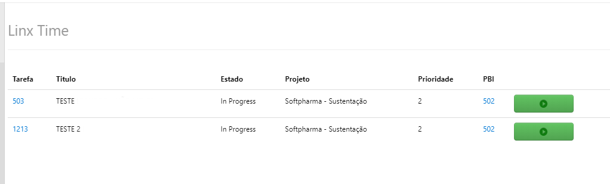
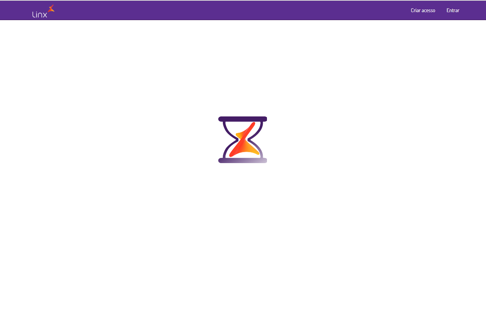
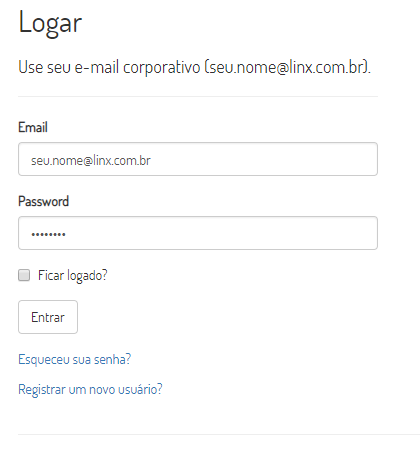
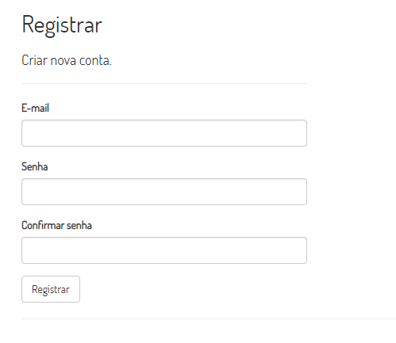
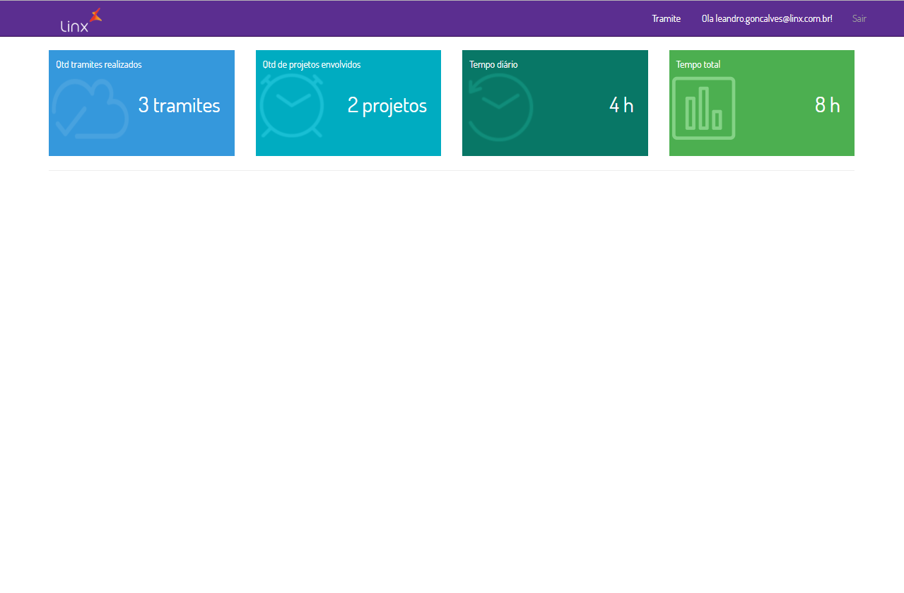
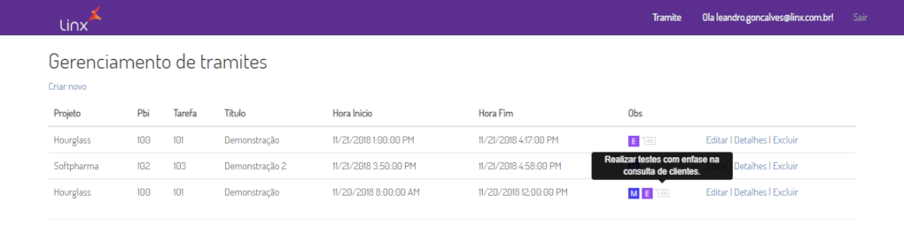
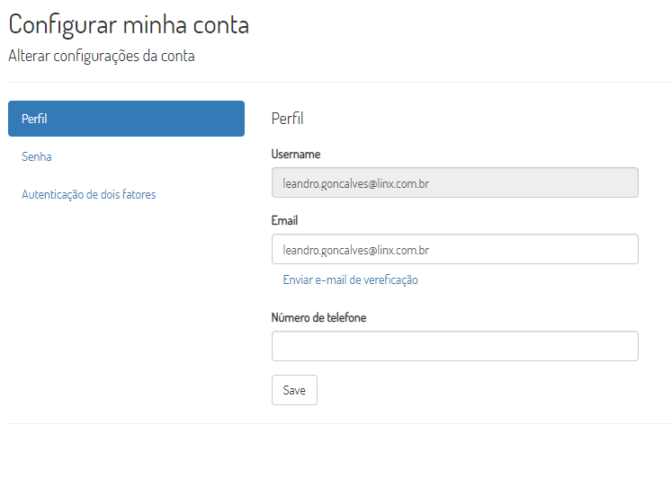

# Hourglass

Essa extensão foi projetada para auxiliar o gerenciamento do uso do tempo do colaborador em cada item de trabalho do projeto.  

[Saiba mais](https://www.linx.com.br) sobre a corporação.

## Veja como usar

Instruções para realizar a assinatura do item de trabalho a conta vinculada ao VSTS. 

#### Hub Gerir Tempo

Dentro do Hub Board se encontra o Hub Gerir Tempo, ao selecionar essa opção será carregado a listagem das tasks em progresso.

#### Listagem de Tasks

A listagem exibe todas as Tasks que estiverem associadas ao e-mail do usuário logado e que estejam diferentes dos estados ('Closed','Completed','Resolved','Removed', 'Done', 'To Do').

Será exibido informações relevantes a task como:
- Código com link de edição direta da task
- Título
- Estado 
- Time
- Atividade
- Retrabalho
- Projeto
- Sprint
- Prioridade
- Código com link de edição direta do PBI ao qual a task pertence
- Botão para início da contagem de tempo da tarefa.

Ao ser dado início a contagem de tempo, será exibido as seguintes informações:
- Código task e título
- Link direto para editar task
- Link para inserir observação ao tramite
- Botão para parar a contagem do tempo da task selecionada.

O tramite do tempo será feito ao clicar no botão responsável por parar a contagem do tempo, caso seja desejado inserir alguma informação, observação, comentário ao tramite, este deverá ser feito antes de parar a contagem.

Caso o usuário entre no Azure DevOps e mude o estado de uma tarefa "In Progress" para "Done" sem antes ter parado o tempo no Gerir Tempo, o tempo não finalizado sera perdido, necessitando ser incluído manualmente pelo usuário no [Gerenciador de Tramites](http://hourglassazure.azurewebsites.net).

## Gerenciamento dos tramites

Ao realizar o tramite do tempo de uma tarefa os dados são enviados a uma base externa, onde pode ser manipulada a partir do seguinte [link](http://hourglassazure.azurewebsites.net). Neste espaço sera apresentado todo tempo tramitado com a extensão Gerir Tempo disponível no Hub Board do Azure DevOps, neste espaço é possível, incluir, editar ou remover tramites manualmente.

#### Tela inicial

Nesta tela sera possivel realizar o login ou registrar um novo usuário para os sistema de gerenciamento de tempo. Novos usuários devem ser registrados com o mesmo e-mail que utilizam no Azure DevOps, ex.(seu.nome@linx.com.br).

#### Tela de login

Tela para informar os dados para acesso ao sistema e ou solicitar nova senha.
Caso solicite nova senha, sera enviado um e-mail com informações para recuparação.

#### Tela para registro de novo colaborador

Tela para registrar um novo colaborador no sistema.

#### Dashboard 

Nesta tela é exibido algumas informações relevantes ao usuário como:
- Quantidade de tramites realizados pelo usuário
- Quantidade de projetos em que os tramites estão envolvidos
- Tempo tramitado durante o dia corrente
- Tempo total tramitado pelo usuário

No topo da tela tem o botão Meus tramites, responsável por abrir a tela de gerenciamento dos tramites.

#### Gerenciamento dos tramites

Nesta tela é listado os tramites realizados, exibindo as seguintes informações:
- Projeto 
- Código da Task
- Código do Pbi ao que a task esta vinculada
- Título da Task
- Hora de início
- Hora final 
- Obs:
- -   Tramite manual
- -   Tramite editado, ao clicar sobre esse ícone sera listado as alterações feitas pelo usuário.
- -   Tramite com comentário/observação
- Botões de ação: Editar, Detalhes e excluir

#### Configurações do usário

Nesta tela é possível alterar informações como e-mail do usuário e alterar senha.

#### Controles para PO/PMO/SM

Os usuários classificados em umas dessas funções tem a disposição as seguintes funcionalidades:

- PO: Tem acesso a visualização de todos os tramites dos colaboradores
- PMO: Tem acesso a visualização e edição de tramites de todos os colaboradores
- SM: Realiza a inclusão/alteração de perfis de colaboradores, manutenção de colaboradores e tem acesso a visualização e edição de tramites de todos os colaboradores
